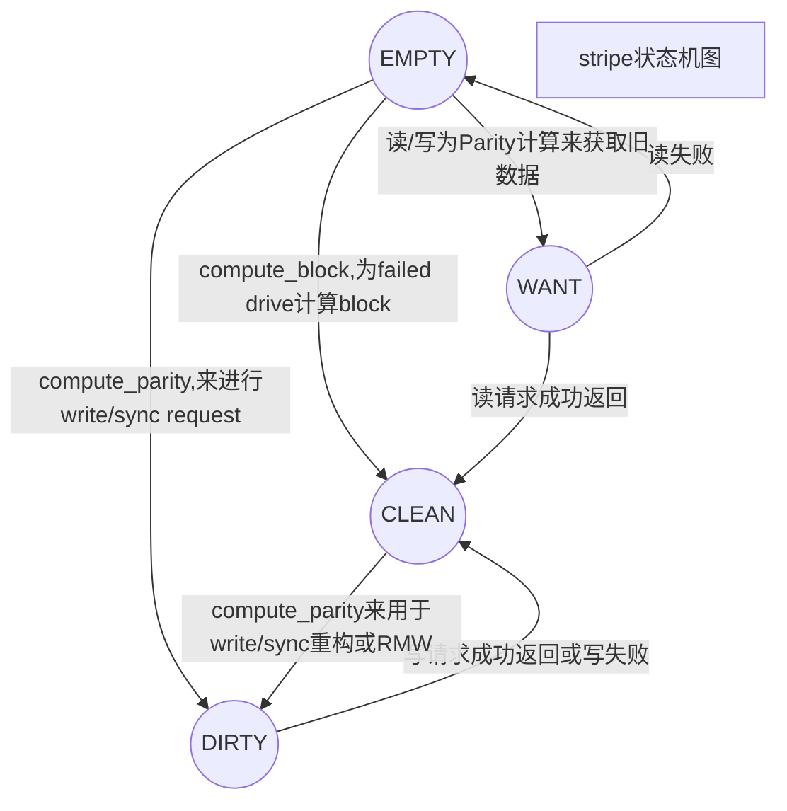
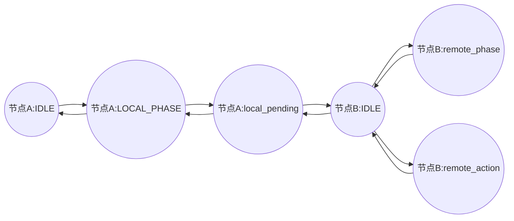

# Linux内核

## [内核数据结构](https://www.bilibili.com/video/BV1J7411y77U?from=search&seid=13420937903768513509)

考虑：为什么使用这些数据结构，怎么使用这些数据结构？

### 链表

### 队列

### 映射

### 二叉树

## Linux线程处理方式（与进程不做区分）

## 文件系统

## Block I/O Layer

(参考Linux内核设计与实现，第14章)


块设备与字符设备： 能够随机访问的为块设备，只能按照字节流顺序访问的为字符设备。

对于字符设备的处理比较简单，因为只需要控制一个位置：当前处理的位置；而对于块设备，由于允许随机访问，因此其寻址方式、效率要求等情况，需要一个完整的子系统来完成。

块设备的最小单位为2的某个次方，一般来说磁盘为512B，一些光盘可能是2KB。块设备的最小单位被称为“块”，是寻址的最小单位。且内核要求不超过一个页的长度（为什么？是否是基于内存页为一个寻址单位的考虑？）。因此一般为512B，1KB，2KB，4KB。

对于机械硬盘来说，其寻址方式为簇、柱面及磁头三者的叠加来表示的，对于SSD则由其主控进行一些地址转换来完成的，其FTL层还会做一些GC和磨损均衡的操作。但主机在访问的时候，只需要通过一个起始地址的逻辑地址LBA和偏移Length来访问，而无需知道下面的转换细节。

Linux设计上，一切皆文件，对于块设备也是如此。当一个块被读入或等待写出时，他需要存储在一个缓冲区中，每个缓冲区与一个块对应，相当于磁盘块在内存中的表示。

缓冲区：`linux/buffer_head.h`

```c
/*
 \* Historically, a buffer_head was used to map a single block
 \* within a page, and of course as the unit of I/O through the
 \* filesystem and block layers.  Nowadays the basic I/O unit
 \* is the bio, and buffer_heads are used for extracting block
 \* mappings (via a get_block_t call), for tracking state within
 \* a page (via a page_mapping) and for wrapping bio submission
 \* for backward compatibility reasons (e.g. submit_bh).
 */

struct buffer_head {
    unsigned long b_state;      /* buffer state bitmap (see above) */
    struct buffer_head *b_this_page;/* circular list of page's buffers */
    struct page *b_page;        /* the page this bh is mapped to *///存储缓冲区的页面
    sector_t b_blocknr;     /* start block number */
    size_t b_size;          /* size of mapping */
    char *b_data;           /* pointer to data within the page *///页面内的数据指针
    struct block_device *b_bdev; //相关联的块设备
    bh_end_io_t *b_end_io;      /* I/O completion *///I/O完成后回调函数
    void *b_private;        /* reserved for b_end_io */
    struct list_head b_assoc_buffers; /* associated with another mapping */
    struct address_space *b_assoc_map;  /* mapping this buffer is                           associated with */
    atomic_t b_count;       /* users using this buffer_head *///使用者的引用计数，用前++，用后--
};
```


一个缓冲区的状态标识如下所示：（***\*TODO:梳理其状态转换\****）


```c
enum bh_state_bits {
    BH_Uptodate,    /* Contains valid data */
    BH_Dirty,   /* Is dirty */
    BH_Lock,    /* Is locked */
    BH_Req,     /* Has been submitted for I/O */
    BH_Uptodate_Lock,/* Used by the first bh in a page, to serialise IO completion of other buffers in the page   */
    BH_Mapped,  /* Has a disk mapping */
    BH_New,     /* Disk mapping was newly created by get_block */
    BH_Async_Read,  /* Is under end_buffer_async_read I/O */
    BH_Async_Write, /* Is under end_buffer_async_write I/O */
    BH_Delay,   /* Buffer is not yet allocated on disk */
    BH_Boundary,    /* Block is followed by a discontiguity */
    BH_Write_EIO,   /* I/O error on write */
    BH_Ordered, /* ordered write */
    BH_Eopnotsupp,  /* operation not supported (barrier) */
    BH_Unwritten,   /* Buffer is allocated on disk but not written */
    BH_Quiet,   /* Buffer Error Prinks to be quiet */
    BH_PrivateStart,/* not a state bit, but the first bit available
             \* for private allocation by other entities   */
};  
```

### BIO结构体


```
linux/bio.h
```

代表了正在现场的，以segment链表形式组织的块I/O操作，允许一个缓冲区分散在内存的多个区域上，而不一定要求连续。这就是所谓的聚散I/O。该功能的实现是通过

```c
/* main unit of I/O for the block layer and lower layers (ie drivers and stacking drivers) */

struct bio {
    sector_t        bi_sector;  /* device address in 512 byte sectors */
    struct bio      *bi_next;   /* request queue link */
    struct block_device *bi_bdev;
    unsigned long       bi_flags;   /* status, command, etc */
    unsigned long       bi_rw;      /* bottom bits READ/WRITE, * top bits priority */
    unsigned short      bi_vcnt;    /* how many bio_vec's */
    unsigned short      bi_idx;     /* current index into bvl_vec */
    /* Number of segments in this BIO after physical address coalescing is performed. */
    unsigned int        bi_phys_segments;
    unsigned int        bi_size;    /* residual I/O count */
    /*
     \* To keep track of the max segment size, we account for the
     \* sizes of the first and last mergeable segments in this bio.
     */
    unsigned int        bi_seg_front_size;
    unsigned int        bi_seg_back_size;
    unsigned int        bi_max_vecs;    /* max bvl_vecs we can hold */
    unsigned int        bi_comp_cpu;    /* completion CPU */

    atomic_t        bi_cnt;     /* pin count */
    struct bio_vec      *bi_io_vec; /* the actual vec list */ //实现页面链接
    bio_end_io_t        *bi_end_io;
    void            *bi_private;

\#if defined(CONFIG_BLK_DEV_INTEGRITY)
    struct bio_integrity_payload *bi_integrity;  /* data integrity */
\#endif
    bio_destructor_t    *bi_destructor; /* destructor */
    /*
     \* We can inline a number of vecs at the end of the bio, to avoid
     \* double allocations for a small number of bio_vecs. This member
     \* MUST obviously be kept at the very end of the bio.
     */
    struct bio_vec      bi_inline_vecs[0];
};
```

### 请求队列

```
linux/blkdev.h
```

### I/O调度程序

注意与进程调度程序与I/O调度程序的区别。前者的作用是将处理器资源分配给系统中的运行进程，而后者是将磁盘的I/O资源分配给系统中所有挂起的块I/O请求，具体来说，这种资源分配是通过将请求队列中挂起的请求合并和排序来进行的。它将决定队列中的请求排列顺序以及在什么时刻派发请求到块设备，以减少磁盘的寻址时间，从而提高全局吞吐量。

主要的操作方式有两种：合并与排序。合并是指将两个或多个请求结合成一个新请求。

### 具体是如何合并的？


## Linux 内核RAID

### WriteHole问题：

Write Hole是一种非常形象的描述。对于一个采用条带内部通过校验数据进行数据保护的系统，当应用程序正在更新条带内部数据的时候，如果系统突然断电，条带数据无法正常更新完成，那么此时就会出现条带中的数据部分更新完成。在这种情况下，当系统重启之后，条带中的数据是不完整的，校验数据和条带中的有效数据无法匹配上，条带处于数据不一致的情况。这种问题就被称之为Write Hole问题，如下图所示：

系统重启之后，通常RAID系统无法感知这种数据不一致的条带。在这种情况下，如果条带中的D3再次发生了故障，那么需要通过校验数据P恢复D3。在数据恢复过程中，使用到了D2’数据，那么显然恢复出来的数据会发生错误，不再是原来的D3数据。所以，数据不一致的条带将会进一步引入数据正确性的问题。即Write Hole问题不仅破坏被更新过的数据，进一步会潜在影响未更新数据的正确性，在极端情况下会影响整条带数据的正确性。

考虑在发生Write Hole问题的时候，即在条带数据更新时，系统突然断电，RAID系统中出现若干数据不一致的条带。在系统重启之后，针对这些数据不一致的条带，可以采用全系统扫描的方式对数据不一致条带进行修复。这也是目前很多RAID系统所常用的方法，通过这种方式可以防止数据不一致条带进一步导致未更新数据的正确性问题。在RAID系统中通常存在SYNC功能，当系统非法重启之后，可以通过SYNC功能对RAID中的所有条带进行检查，并且将数据不一致条带进行修复。这种方式可以防止Write Hole问题的扩散，但是还是会导致RAID系统中部分数据的彻底丢失。

为了彻底解决Write Hole问题，在设计RAID的时候可以采用如下两种方法：

1，采用文件系统的Journal（日志）的设计思想，实现写请求的原子处理

2，借助于采用非易失性内存做为写缓存，达到原子写操作的目的

这两种思路本质上是类似的，第二种是对第一种的优化。我们知道文件系统在数据更新的时候为了保证数据更新的原子性，可以采用日志的方式，把一次数据更新操作看成一次transaction（事务）。即不管一次数据更新操作有多少次IO，从外部来看这是一次原子操作，可以称之为atomic write。当atomic write中间过程发生故障时，系统重启之后可以继续操作，保证数据要么更新完成，要么完全没有写入，不会存在中间状态。RAID系统想要解决Write Hole的问题，也需要引入这种Atomic write的机制。很直接的想法是在每次RAID进行条带数据更新的时候，首先记录一下日志，保存事件类型以及相关的数据；然后再将数据提交到条带中；当条带数据全部更新完成之后，清除日志数据。这种方式可以保证原子写，即使在条带数据更新过程中发生系统故障，系统重启之后，通过日志数据可以继续写过程，保证条带数据完全更新完毕，并处于数据一致的状态。

日志的方式看似完美，但是会严重影响性能。在磁盘存储系统中，日志更新非常耗时，一次更新需要进行多次磁盘IO操作，如果日志存储空间和条带存储空间在物理上不连续，那么将会引入磁盘抖动问题，严重影响性能。对于闪存存储系统，引入日志系统之后，所有的数据操作将会引入双倍的数据写入操作，写放大问题变得非常棘手。所以，在开源RAID系统中，都没有提供这种日志操作方式，通常需要上层的文件系统来解决这种write hole的问题。在商用的一些RAID系统中，为了保证极致的数据可靠性，有些系统实现了这种日志数据更新方式，达到Atomic Write的目的。

另一种比日志方式更好的方法是引入非易失内存NVRAM。在更新RAID数据的时候，首先将数据写入非易失内存中，当NVRAM中的数据聚合完毕之后再更新写入条带。当条带中的数据更新完毕之后，再将NVRAM中的数据清楚。在条带数据更新的过程中，如果系统出现异常重启，由于NVRAM中依然存在未完成更新的数据，所以，条带中的数据将会被再次更新，不会存在中间数据状态，不会存在Write Hole的问题。

采用NVRAM的这种方法是比较完美的Write Hole解决之道。对于硬RAID，往往采用热备电池或者超级电容的方式保护RAID卡上的内存，起到的就是这个作用。所以，和软RAID相比，硬RAID在这一点上会更胜一筹。在软RAID中，可以在系统中使用PCIe NVRAM或者NVDIMM来实现RAID的非易失数据缓存。通常在存储系统中，软RAID会和文件系统、上层的应用系统进行配合，因此，NVRAM也会和文件系统进行共享，从而解决掉Write Hole的问题。EMC的很多存储系统就会采用非易失内存NVRAM，让文件系统与RAID进行配合，避免RAID处于Write Hole的状态。

Write Hole是RAID的一个比较难于解决的问题，但是借助于最新NVDIMM等非易失内存技术之后，该类问题可以有效的避免和解决。

### RAID 4/5/6 cache

Raid 4/5/6 could include an extra disk for data cache besides normal RAID disks. The role of RAID disks isn't changed with the cache disk. The cache disk caches data to the RAID disks. The cache can be in write-through (supported since 4.4) or write-back mode (supported since 4.10). mdadm (supported since 3.4) has a new option '--write-journal' to create array with cache. Please refer to mdadm manual for details. By default (RAID array starts), the cache is in write-through mode. A user can switch it to write-back mode by:

\```

echo "write-back" > /sys/block/md0/md/journal_mode

\```

And switch it back to write-through mode by:


\```

echo "write-through" > /sys/block/md0/md/journal_mode

\```

In both modes, all writes to the array will hit cache disk first. This means the cache disk must be fast and sustainable.

***\*write-through mode\****This mode mainly fixes the 'write hole' issue. For RAID 4/5/6 array, an unclean shutdown can cause data in some stripes to not be in consistent state, eg, data and parity don't match. The reason is that a stripe write involves several RAID disks and it's possible the writes don't hit all RAID disks yet before the unclean shutdown. We call an array degraded if it has inconsistent data. MD tries to resync the array to bring it back to normal state. But before the resync completes, any system crash will expose the chance of real data corruption in the RAID array. This problem is called 'write hole'.The write-through cache will cache all data on cache disk first. After the data is safe on the cache disk, the data will be flushed onto RAID disks. The two-step write will guarantee MD can recover correct data after unclean shutdown even the array is degraded. Thus the cache can close the 'write hole'.In write-through mode, MD reports IO completion to upper layer (usually filesystems) after the data is safe on RAID disks, so cache disk failure doesn't cause data loss. Of course cache disk failure means the array is exposed to 'write hole' again.In write-through mode, the cache disk isn't required to be big. Several hundreds megabytes are enough.

***\*write-back modewrite-back mode\**** fixes the 'write hole' issue too, since all write data is cached on cache disk. But the main goal of 'write-back' cache is to speed up write. If a write crosses all RAID disks of a stripe, we call it full-stripe write. For non-full-stripe writes, MD must read old data before the new parity can be calculated. These synchronous reads hurt write throughput. Some writes which are sequential but not dispatched in the same time will suffer from this overhead too. Write-back cache will aggregate the data and flush the data to RAID disks only after the data becomes a full stripe write. This will completely avoid the overhead, so it's very helpful for some workloads. A typical workload which does sequential write followed by fsync is an example.In write-back mode, MD reports IO completion to upper layer (usually filesystems) right after the data hits cache disk. The data is flushed to raid disks later after specific conditions met. So cache disk failure will cause data loss.In write-back mode, MD also caches data in memory. The memory cache includes the same data stored on cache disk, so a power loss doesn't cause data loss. The memory cache size has performance impact for the array. It's recommended the size is big. A user can configure the size by:`echo "2048" > /sys/block/md0/md/stripe_cache_size `Too small cache disk will make the write aggregation less efficient in this mode depending on the workloads. It's recommended to use a cache disk with at least several gigabytes size in write-back mode.

The implementationThe write-through and write-back cache use the same disk format. The cache disk is organized as a simple write log. The log consists of 'meta data' and 'data' pairs. The meta data describes the data. It also includes checksum and sequence ID for recovery identification. Data can be IO data and parity data. Data is checksumed too. The checksum is stored in the meta data ahead of the data. The checksum is an optimization because MD can write meta and data freely without worry about the order. MD superblock has a field pointed to the valid meta data of log head.The log implementation is pretty straightforward. The difficult part is the order in which MD writes data to cache disk and RAID disks. Specifically, in write-through mode, MD calculates parity for IO data, writes both IO data and parity to the log, writes the data and parity to RAID disks after the data and parity is settled down in log and finally the IO is finished. Read just reads from raid disks as usual.In write-back mode, MD writes IO data to the log and reports IO completion. The data is also fully cached in memory at that time, which means read must query memory cache. If some conditions are met, MD will flush the data to RAID disks. MD will calculate parity for the data and write parity into the log. After this is finished, MD will write both data and parity into RAID disks, then MD can release the memory cache. The flush conditions could be stripe becomes a full stripe write, free cache disk space is low or free in-kernel memory cache space is low.After an unclean shutdown, MD does recovery. MD reads all meta data and data from the log. The sequence ID and checksum will help us detect corrupted meta data and data. If MD finds a stripe with data and valid parities (1 parity for raid4/5 and 2 for raid6), MD will write the data and parities to RAID disks. If parities are incompleted, they are discarded. If part of data is corrupted, they are discarded too. MD then loads valid data and writes them to RAID disks in normal way.

### 软RAID与硬RAID

### Linux RAID5设计整理

```
md/raid5.h
```



## RAID

### 传统式RAID

传统RAID即早期的思路，常用的就是RAID0，RAID1，RAID5/6。这里只说明RAID5/6。

#### 条带化

#### 数据校验算法

#### 可扩展性

#### 传统式RAID的性能与可靠性

#### 性能

表征RAID性能的一个重要参数是写惩罚。在理解写惩罚之前，需要明白几个重要的概念：满写、大写、小写。

#### 可靠性

RAID的可靠性是很难理论计算出来的。我们知道，在一定的范围内，盘的数目越多，数据越能分散到多个盘中，并发量越大，性能应该是越好的，然而需要盘数目越多，意味着坏掉的几率越大。

### 分布式RAID

#### 解决的问题及兴起

#### 什么是分布式RAID

#### 分布式RAID的本质是什么？

与传统RAID相比，分布式RAID的最大的特点在于将校验盘所提供的校验数据分块由原来的传统RAID的“固定在一个磁盘上”，更改为“由多个磁盘来共同提供”。即：将校验数据分块打散到整个组成RAID的磁盘中。

这在空间布局上有什么区别呢？


如上图所示，TRAID的空间布局中，一共有4个数据盘+2个校验盘（P,Q)+1个热备盘。数据分块由Di来表示，校验分块用P、Q来表示，热备分块由S来表示。可以看到，一块盘只负责提供固定的功能。当其中一块盘发生故障，例如D1所在的一列的盘发生故障，那么就需要占用整个S磁盘的带宽来进行重构。另一方面，常规意义上的校验算法（无论是伽罗华域算法还是斜向校验算法），在使用这种空间布局的时候，磁盘的最大数目是受到性能限制的。

当考虑RAID的性能的时候，就需要考虑RAID的写放大。什么是RAID的写放大呢？

不严谨地讲，所谓的写放大，是指在写一份数据的时候，是否需要一些额外的操作才能完成这个写操作。

以上图所示的4+2+1的RAID6为例，可以看到条带宽度为4。假设一个分块大小为256KB，那么一个分条能够存储的数据为1MB。

当上层下发的数据为刚好1MB时，就可以直接占满一个条带，并直接根据这4个数据分块计算校验位PQ，一次将其写入，此时的写放大为0，即没有写放大。这是最理想的情况。

> 在一些存储系统的实现中，为了能够尽可能达到满分条写的效果，经常在RAID层以上的某层将I/O请求进行聚合，即将数据先进行缓存，然后满足一定的条件后一起将数据下刷，达到随机写转为顺序写的效果。**这里的聚合就涉及到日志卷的设计方案，例如日志卷的空间布局、聚合方式、下刷条件、PBA分配方式、可用空间管理、垃圾回收等等，将在下文指出，此处按下不表**。

> 无论底层介质是机械盘还是SSD，顺序写性能是高于小块的随机写的。以机械盘为例，且不说顺序写时磁头将大多数时间无需频繁寻道，当数据为顺序的时，元数据的更改也会比随机写小得多。

而当上层下发给RAID的数据不满于一个条带时，由于部分更新该条带，那么就需要读原有的数据，与新下发的数据一起重新计算校验位。这就造成了写放大。

而在实现的过程中，实际上根据异或计算的特性做了一些小优化：当不是满条带写的时候，又可以划分为小写和大写。

所谓的小写，就是指写入数据量相对于一个条带来说很小，那么就可以通过这个要写入的分块，和已有的校验分块P进行异或计算，以间接得到剩余的所有数据块的异或结果，然后再与这个要写入的分块与该结果再次进行异或计算，重新计算更新后的P。

而大写，是指写入数据量相对于一个条带来说较大，但不满一个条带，此时可以通过读起来原有的无需更新的条带，与要更新的所有数据分块进行异或计算，得到新的P，然后写入。

大写和小写的小优化的本质实际就是通过**尽可能地少读盘**来实现的。


#### 传统RAID与分布式RAID的区别是什么？

#### RAID的本质：数据分片及分条一致性

#### 元数据管理

元数据是整个RAID业务的核心。它表示了RAID内部的数据组织方式，可用性，进度等。

举例说明，一个I/O是一个起始位置为lba,长度为offset的数据，当下发到RAID层时，一般来说需要对其进行拆分。

那么此时如何知道这一块数据要被拆分为几块呢？

拆分完成后的分块如何知道要落到哪一块盘的哪一块条带的哪一个分块上呢？

假设该RD为RD5/6，还需要计算校验位，那如何知道计算

在初始化、重构、巡检等操作的时候，如何知道某个分条已经被操作过了？如何知道当前已经处理的进度是多少？

如何使用集群实现系统的高可用？如何实现双控之间的数据同步？这是否属于IPC？是如何实现的？

在搞明白以上这些问题之前，首先需要知道RD一般来说有哪些操作。

#### RD请求类型

毫无疑问，按照最低级的思路来想的话，应该是读和写两种。然而，在实际实现的过程中，考虑到一些复杂的场景，例如前端I/O请求针对某个条带，而这个条带正在被某个后台任务处理，或该条带还未被初始化，需要首先进行初始化，才能进行读写处理。另外，再考虑到一些优化（满写、大写、小写，慢盘检测、抢先重构）等等，也会需要一些特殊处理的流程以提高系统的运行效率。

这样下来，就可以抽象出来以下几种操作：

\1. 读请求

\2. 满写请求

\3. 大写请求

\4. 小写请求

\5. 前台初始化与后台初始化请求

\6. 全盘重构请求

\7. 校验重构请求

etc.


\> *在考虑每种请求的处理流程过程中，需要考虑以下几点>

\> 1. 元数据组织方式

\> 2. 多节点间高可用相关处理（元数据更新镜像）

\> 3. 条带的 竞态条件的处理

\> 4. 可能的与其他请求的重叠处理

\> 5. 可能的与一些后台任务针对同一条带的重叠处理

下面将一一简要说明。

#### 初始化

对于RAID5/6来说，其最重要的一点就是条带化的校验位计算。（为简化说明，以下均使用RAID5来做说明）在坏掉一块盘的时候我们可以通过重构（根据算法的不同而实现方法不同，在这里可以简单地理解为异或计算）将坏掉的盘的数据重构到热备盘上，甚至可以直接通过校验计算还原读起来。

初始化的作用就是将RAID中的所有条带写零，以达到初始时***\*分条一致\****的效果。

\>  分条一致性是RAID中最重要的概念。在任何条件下，只要能够满足分条一致性，那么数据就是安全的。

需要首先说明的是，初始化可以分为前台初始化和后台初始化。

前台初始化意为，当下发一个读或写请求到一个条带上的时候，需要首先判断该条带的初始化状态，若未被初始化的话，则会触发前台初始化功能，将该条带进行写零操作。这也就意味着，一个条带若被写过，拥有有效数据的话该条带的状态一定是已经被初始化过的。

后台初始化意为，起一个后台任务，将该RAID的所有条带都写零一遍。

那么既然前台初始化功能已经有了，可以保证写前分条一致性，那么为什么还需要后台初始化？

一般来说，后台初始化功能是可以关闭的，在测试性能的时候一般会这么做，但在实际使用中是不建议关闭的。原因在于高可用场景。试想一下，当正在写一个条带的时候，写到其中几个分块时突然设备发生故障（无论是软件故障还是硬件故障），导致剩下的几个分块无法被写入，这样这个分条的就是不一致的状态。***\*？？？？\****

那么实现初始化需要考虑哪些内容呢？

首先我们在创建好RAID后，就可以根据其空间布局知道一共有多少个条带，每个条带都使用一个该RAID内唯一的条带号来标识。

以一个3+1的RAID5为例，其分条和分块的表示图如下所示，分块0~2为数据分块，分块3位校验分块，各自对应一块磁盘。一共有N+1个分条，其条带号为0~N。


#### 元数据空间布局

因此，我们需要一个数据结构来描述哪些条带已经被初始化了，哪些条带还未被初始化。要实现这样的功能，使用一个Bitmap是最简单的方法：


这样空间复杂度为O(n),时间复杂度为O(1)，纯内存操作，效率很高。

#### 元数据的查询、设置、清理

对于该元数据，毫无以为我们需要实现查询、设置为1，清理为0的三个基本功能。这很容易想到，也很容易实现。

对于查询功能，该功能的实现是基于这么两种考虑：第一，需要一个接口

#### 元数据的高可用

##### 集群中节点镜像实现高可用

元数据是十分关键的信息。在多节点组成的集群中，数据可能由任何一个节点接收并作为master节点处理，而要实现高可用，需要进行元数据的同步，这样在发生故障时，剩余存活的节点就可以接管故障节点的工作。

以两个节点组成的集群为例，其同步流程可以是这样的（业务下发到节点A，被称为master节点，节点B为其镜像，被称为slave节点）：

```sequence
Title: 元数据两节点同步

Note over 节点A: 写零请求下发

节点A->节点B: 发起元数据同步请求

Note over 节点B: 清理元数据

节点B-->>节点A: 回复同步请求(响应)

Note over 节点A: 清理元数据

Note over 节点A: 初始化请求完成
```

可以看到，一个合理的高可用处理流程必定是这样的：master节点处理业务，然后将元数据信息同步给slave节点，等slave节点确认更新完成后，再更新master端的元数据信息，这样可以确保这次操作已经被slave节点记录，若master端故障时，slave节点可以拥有该业务的完整镜像。

##### 内存非易失性实现高可用

上面讲的使用集群多节点来实现高可用，可以避免系统单点故障，却无法避免系统整体故障--例如掉电故障、集群软件故障等。在这几种情况下，由于内存是易失性的，因此若不特殊保护的话，内存数据都会丢失。

这种可以通过备用电源+内存重新组织的功能来实现。使用一个守护进程来检测业务进程的可用性，当发现业务进程奔溃，便将内存中的被特殊标记的Page下刷到磁盘中。等到节点上电，业务进程被重新启动的时候，进入初始化流程，此时可以判断是否有被下刷到磁盘中的数据，若有，则将其重建。

#### 【待补充

可以理解得是，重新启动后该业务进程的地址空间可能和之前不同，那么数据是如何重新组织的呢？

我们知道，一个进程地址空间被划分为多个逻辑区域，地址空间从大到小依次包括内核虚拟内存区域（堆用户代码不可见）、用户栈区（运行时创建）、共享库的内存映射区、运行时堆（由`malloc`创建）、数据读写段（`.data`,`.bss`）、只读代码区。

数据被下刷到磁盘中，然后读起来恢复，需要一整套内存管理机制，需要考虑如下方面：

\1. 如何进行内存管理，以尽量减少内存碎片的产生

\2. 如何标记需要被保护的内存页

\3. 如何确保恢复的数据结构是对的（校验）

\4. 如何根据恢复的内存页来重建内存中的数据结构

#### 重构

#### 校验

### 【待完善】巡检

巡检功能是以后台任务的方式，将所有条带都读上来一遍，进行校验计算，检查该条带的分条一致性。该功能的主要目的是进行坏块检测与尝试修复，若修复失败，则标记该分块对应的磁盘所在的扇区为坏块**（然后呢？）**。是定期开启的、低优先级的。

要实现这样的功能，同样需要考虑这样几个方面：

#### 元数据空间布局

初始化任务的随机性（即主机I/O可能下发到任何一个条带），决定了初始化的元数据位图只能是全量的--需要同时表示所有的条带的处理情况。而巡检任务是一个顺序的过程，它将从零开始向后移动，逐个条带进行处理，而无需记录之前已经处理过得条带。这样一来，我们无需用能够表示所有条带的位图来描述这种场景--不必要，浪费空间。

巡检任务是后台操作，且是一个校验功能，不能影响主机I/O的性能：即，这个任务需要有处理速度的控制功能，需要能在前段I/O处理压力大的时候降低或者暂停当前的巡检任务，而在前端I/O处理压力较小或者没有前端I/O的时候以较大功率继续当前的巡检任务；

后退一步想一想需要实现的功能：

\1. 需要能够描述哪个条带已经被处理

\2. 需要能够记录当前处理进度，并能够继续从当前进度开始工作

\3. 需要能够以不同的速率运行

\4. 基于3，需要能够描述”速率“，同样也可以考虑到进度的表示与更新

因此我们可以想象，只需要一个类似于滑动窗口大小的位图就可以实现这样的功能，而无需搞一个全量的基于所有条带的位图。

#### 元数据的查询、设置、清理

#### 元数据的高可用

与初始化相同

#### 慢盘检测

这种校验计算还可以提供一些小优化，例如抢先重构。例如，当主机一个请求下发到一个RAID的一块磁盘（即分块）上，下发之前会加到一个队列中并记录开始时间，并在另外一个线程中定时检测超时时间。若到达超时时间，则可以认为磁盘为”慢盘“。这样的话可以等待这块慢盘返回数据，也可以直接通过剩余的其他盘来校验计算，这样的操作被称为”抢先重构“。

### 多节点信息同步功能

可以想象得到，针对上面所述的几种场景，多节点信息同步一个通用的功能，因此该模块可以是一个独立的模块。

这个模块需要考虑哪些内容呢？

\1. 通用的多节点通信功能，需要能够将数据打包发送，并在其他节点通过指针解析出来；并需要考虑多节点通信的并发限制。

\2. 每个节点应该有独立的工作流程，其任务应由该节点独立处理，但由于多节点的流程是顺序的，因此状态需要由多节点共享

\3. 每个节点应该有一个队列来暂存需要处理的请求，来实现序列化处理流程

这样，我们可以想到任务的状态机转换：



### 任务调度

### 线程模型

锁：一个条带有条带锁，同一时刻只能有一个线程操作同一个条带。 

### 后台任务管理

#### 任务管理数据结构

#### 进度监测

#### 速度控制

##### RAID重构性能优化

集采要求拔盘后重构，重构每TB不超过90min，且主机I/O性能下降不超过15%。

原有的重构策略，是将该块盘所在的条带进行重构，此时将处理所有的条带。

之后的新的快速重构的设计思路是，添加一层bitmap，用来表示已经写入有效数据的条带号，在拔盘以后重构时，只重构具有有效数据的条带。这样就可以避免重构未被使用的条带。

在考虑后台任务与前台I/O的性能影响时，需要考虑的后台任务的调度策略。

后台任务的调度有以下几方面考虑：

1. 后台调度的基本框架

   一个控制器一个Instance，有一个Scheduler[]数组，每个array_id一个。对于每个array_id，有高低两个优先级队列Queue，各自挂一个链表Array结构体，然后在上面挂一个Task[] 数组，可以包含多个后台任务。对于每个Task，使用一个Work结构体来管理。work是直接处理的对象，其中管理着一组grain[]，代表着要处理的条带号。

2. 后台任务的基本策略：

   前台一个定时器任务，用于遍历该array_id的优先级队列，若有的话就将任务取出干活。此处还涉及到条带锁、元数据同步、清除元数据、查询元数据获得要处理的下一个条带等操作。

   以上是无脑的操作，实际工程中需要处理多个后台任务的优先级、以及某个后台任务的独自的调度策略。

   1. utmd监测mode_data的改变，此时会触发agt端qar操作，每次更改都会updateDispatchPolicy，此时每次都会stopTask，然后startTask，按照新的策略进行调度。
   2. 


### I/O流程

#### 上层I/O的拆分

#### 满写、大写、小写

#### I/O流：从RAID层入口到RAID层以下